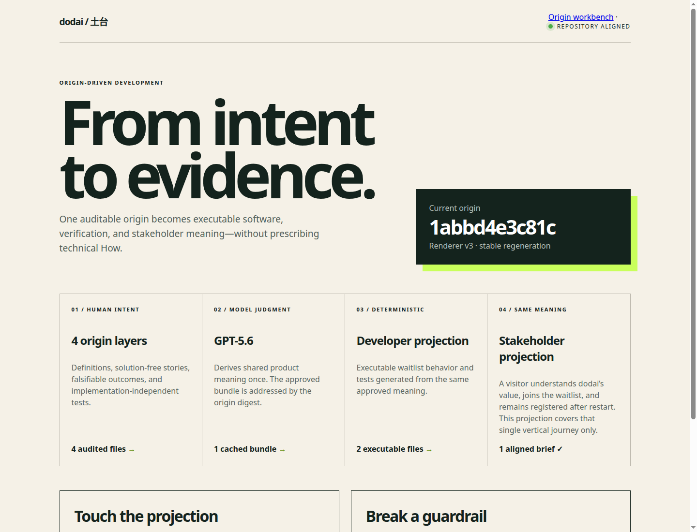
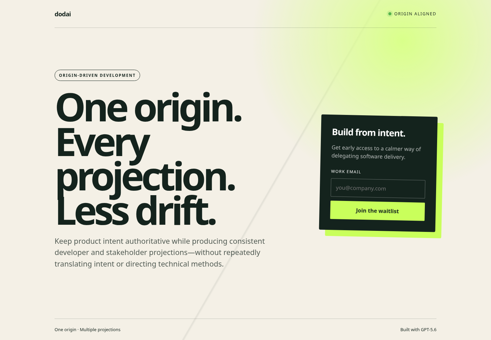
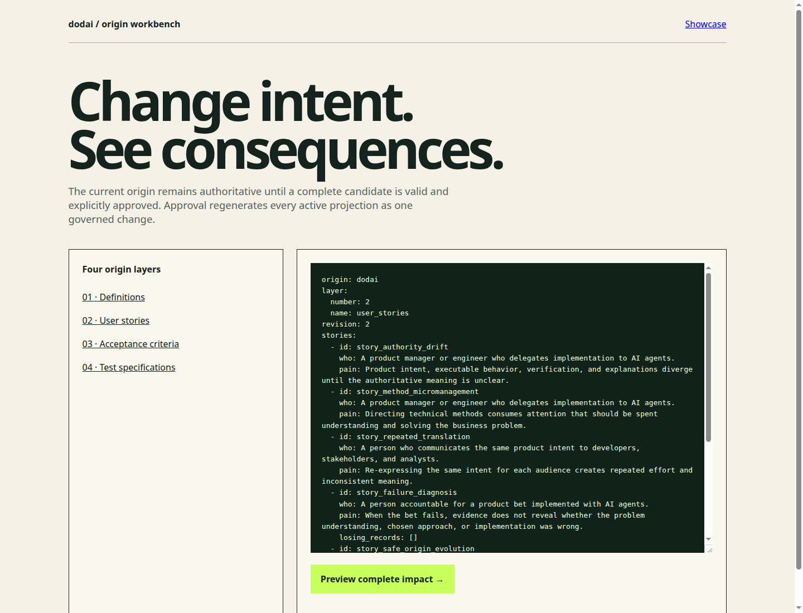

# dodai

dodai is an origin-driven development tool for product managers and engineers
who delegate implementation to AI agents without surrendering authority over
business intent. One human-auditable origin produces executable developer
artifacts, verification, and stakeholder communication. Every presentation is
traced back to the story, outcome, and test specification that justify it.

Built for the OpenAI Build Week 2026 Developer Tools track.

## What the product journey does

The browser starts from the product manager's work rather than internal origin
files:

1. Name a product bet and describe its actor and pain in Japanese.
2. Detect prescribed How and recover the intended outcome before it reaches a story.
3. Describe observable success and what the person does first and receives last.
   Dodai owns operational defaults; product-specific language is optional context.
4. Review a plain-language explanation of intent, checks, and what approval starts.
5. Review the model-request maximum, cost guardrail, and cache state, then consent.
6. Judge the delegation result against the still-visible actor, pain, and outcome.
   Inspect executable behavior, satisfied and unsatisfied verification, and
   stakeholder meaning with explicit origin evidence.
7. Request a plain-language change and approve or reject its complete impact.
8. Enter outcome evidence and see whether it disproves problem understanding,
   verification, or the produced presentation, or remains inconclusive.
9. Return later, see each bet's current stage and next decision, and resume safely.
10. Review a bounded Codex plan, explicitly consent once, and delegate into a
    repository owned by the product bet.
11. Inspect changed file contents, successful verification commands, stakeholder
    meaning, and their Story-to-AC-to-test evidence; accept or re-delegate without
    changing the approved intent.

The [origin](origin/README.md) is authoritative. The committed
[projections](projections/) are disposable evidence of what can be regenerated.
The complete user journey, trust boundaries, and executable completion evidence
are mapped in [Product Journey and Completion Evidence](docs/PRODUCT_JOURNEY.md).

## Requirements

- Python 3.12 or later
- [uv](https://docs.astral.sh/uv/)
- macOS, Linux, or Windows with a POSIX-like shell for the commands below
- An OpenAI API key only when deriving fresh content with GPT-5.6
- An installed and authenticated Codex CLI only for real repository delegation

## Setup

```bash
git clone https://github.com/disneyLadySango/dodai.git
cd dodai
uv sync --extra dev
```

## Run the keyless demo

The sample provider exercises the complete deterministic projection path
without credentials:

```bash
uv sync --locked --extra dev
bash scripts/demo.sh
```

The script validates the origin, shows the committed GPT-5.6 stakeholder
projection, proves a cache-only rebuild, and evaluates a guardrail breach in a
disposable copy. It does not modify the repository or call the OpenAI API.

The individual commands are:

```bash
uv run dodai --root . lint
uv run dodai --root . project --sample
uv run dodai --root . project --sample
uv run dodai --root . rebuild-test
```

The repository includes an approved bundle for its current origin, so repeated
projection reports `stable` without an API request. A new origin digest reports
`changed` when its first approved bundle is produced. Generated developer code
and tests live under `projections/developer/`, while the shared stakeholder
explanation lives under `projections/stakeholder/`.

## Run the product

Start the complete keyless product journey with one command:

```bash
bash scripts/demo-web.sh
```

Open <http://127.0.0.1:8000>. Create a product bet and complete the guided flow
from pain through success, verification approval, informed generation, bounded
delegation, repository evidence, adoption, governed change, and telemetry
learning. `demo-web.sh` uses inspectable sample providers for both semantic
derivation and delegation, so the complete journey requires no credential and
makes no API request. It still changes a real isolated Git repository and runs
its verification. Product-bet state is resumable under ignored `.dodai/workspaces/`.

To use GPT-5.6 for newly approved origins, set `OPENAI_API_KEY` in the launching
environment and run without `--sample`:

```bash
uv run dodai --root . showcase
```

Dodai shows the maximum external request count, cost guardrail, and cache status
before consent. A successful approved identity is cached; repeating generation
for the same origin and pins performs no additional model request.
Real repository delegation has a separate consent screen. Dodai invokes
`codex exec` with an ephemeral `workspace-write` sandbox scoped to
`.dodai/workspaces/<bet>/delegation/repository`, consumes a schema-constrained
result, and independently derives changed-artifact evidence from Git. Raw Codex
events, session identifiers, stderr, and environment values are not retained.
Each delegation must include an immediately usable static product at
`product/index.html`. Dodai validates that contract and serves only the bounded
`product/` tree in a sandboxed frame with outbound connections blocked. The
person can therefore operate the actual delegated result before accepting it.
Codex automation ignores unrelated user configuration while retaining CLI
authentication, so personal profiles or required MCP servers cannot silently
change the attempt.
If the final Codex message is absent after a successful run, Dodai can recover a
bounded handoff from the product entry point, stakeholder document, and observed
successful verification command instead of discarding otherwise complete work.
The guided local product-bet design and its MVP boundaries are recorded in
[ADR 0004](docs/adr/0004-guided-local-product-bets.md), with the delegation
boundary in [ADR 0006](docs/adr/0006-bounded-codex-delegation.md).
The experienceable delivery contract and its security tradeoffs are recorded in
[ADR 0007](docs/adr/0007-static-delegated-product-contract.md).

The guided product journey opens in Japanese. Audit mode exposes an
`English` / `日本語` control so the product owner can inspect the complete
four-layer origin in either presentation language. The language definition is
explicitly mapped to stable origin record IDs; switching audit language does
not change impact analysis, approval outcomes, origin identity, or projection
identity.



The generated waitlist supports valid, duplicate, and invalid registration
feedback and retains registrations across server restarts. It is an
interchangeable proof sample, not Dodai's product value. The result screen shows
the approved story, behavioral evidence, stakeholder meaning, and their
machine-readable mapping in `projections/evidence.yaml`.

The waitlist remains only a deterministic derivation proof. The primary result
journey shows the Codex-created repository changes, successful verification
commands, stakeholder meaning, and explicit adoption decision.



## Evolve the origin safely

Open <http://127.0.0.1:8000/workbench> when internal auditing is needed. The
workbench exposes all four authoritative layers. Editing a layer creates a
candidate revision: Dodai validates it, reports every affected origin record
and active projection, and leaves the current origin unchanged.

Explicit approval verifies and regenerates the complete candidate before making
it authoritative. A failed regeneration or a stale preview changes nothing.
Successful approval connects the human decision, before and after origin
identities, validation, and resulting projection identity in local change
history. Candidate and history state under `.dodai/` is ignored by Git.

The repository-backed technical proof remains available at
<http://127.0.0.1:8000/proof>.



The same lifecycle is available from the CLI:

```bash
uv run dodai --root . preview 02-user-stories.yaml candidate.yaml
uv run dodai --root . approve CANDIDATE_ID --approved-by "Product owner"
uv run dodai --root . reject CANDIDATE_ID
uv run dodai --root . derivability
uv run dodai --root . attribution
```

Approval uses GPT-5.6 when the candidate has no approved semantic bundle. Add
`--sample` only for an inspectable keyless exercise; it is never presented as a
replacement for the live model path.

## Adopt product learning

A guardrail breach remains a non-authoritative proposal. It can be reviewed as
a layer-four candidate and explicitly adopted while layers two and three stay
fixed:

```bash
uv run dodai --root . adopt .dodai/proposals/PROPOSAL.yaml
```

Candidates that repeat an approach named by a story-level losing record are
blocked with the prior evidence. The browser showcase exposes the same proposal
adoption path after its isolated guardrail scenario.

## Start another origin

Initialize a second product without changing Dodai itself:

```bash
uv run dodai init ./another-product \
  --name another-product \
  --who "A team accountable for a product outcome." \
  --pain "Product intent and role-specific explanations diverge." \
  --journey "A person reviews one approved outcome and its evidence."
```

The initialized workspace contains a valid four-layer origin and projection
pin. `waitlist` retains the interactive sample; `brief` is the reusable
executable-meaning projection. The renderer decision is documented in
[ADR 0003](docs/adr/0003-configured-projection-kinds.md).

## Derive content with GPT-5.6

Set `OPENAI_API_KEY` in your environment or secret manager. Never add it to this
repository. Then force semantic re-derivation:

```bash
uv run dodai --root . project --refresh
```

dodai uses the OpenAI Responses API with the `gpt-5.6` alias and strict
structured output. GPT-5.6 performs the judgment-heavy translation from origin
intent into role-neutral product meaning. Audited renderers own executable
structure, and the approved semantic bundle is cached by origin digest so later
regeneration is stable. The choice is recorded in
[ADR 0001](docs/adr/0001-bounded-model-generation.md).

OpenAI documents `gpt-5.6` as the GPT-5.6 Sol alias and supports both the
Responses API and structured outputs for this model:
[model documentation](https://developers.openai.com/api/docs/models/gpt-5.6-sol).

A live GPT-5.6 generation was verified on 2026-07-20. The committed semantic
bundle and both role projections are the resulting reproducible evidence; no
API key or request identifier is stored in the repository.

## Exercise the outer loop

A guardrail breach keeps the story and acceptance criterion fixed and proposes
revised verification under `.dodai/proposals/`:

```bash
uv run dodai --root . telemetry examples/telemetry/guardrail-breach.yaml
```

The exit-condition example appends an idempotent losing record to the affected
story. Run it only in a disposable checkout because it intentionally changes
the origin:

```bash
uv run dodai --root . telemetry examples/telemetry/exit-condition.yaml
```

## Testing

```bash
uv run ruff check .
uv run ruff format --check .
uv run mypy
uv run pytest -q
uv run pytest -q projections/developer
uv run dodai --root . lint
uv run dodai --root . rebuild-test
uv build
```

## Architecture

```text
four-layer origin + projection pins
              |
              v
      vocabulary validation
              |
              v
 GPT-5.6 semantic derivation ---> origin-addressed approved cache
              |                              |
              +------------------------------+
                             |
                             v
                deterministic renderers
                   /                 \
                  v                   v
       developer code + tests   stakeholder brief
                  \                   /
                   +---- rebuild ----+

simulated telemetry ---> guardrail proposal | story-level losing record

candidate revision ---> impact preview ---> human approval
        |                                      |
        +---- reject: no observable change    +---- validation + regeneration + history
```

Technical choices are projections, not origin requirements. They are retained
under `docs/adr/` and `pins/` to make regeneration reviewable and stable.
Governed origin transactions are documented in
[ADR 0002](docs/adr/0002-governed-origin-transactions.md).

## Codex collaboration

The product contract intentionally delegated technical How to Codex. The human
owner supplied the problem framing, four-layer discipline, falsifiable outcomes,
guardrails, exit condition, and the decision to rename the product from Genten
to dodai. Codex designed the representation, derived layer-4 test specifications,
selected the bounded GPT-5.6 architecture, implemented the vertical slice with
red-green-refactor cycles, and verified the resulting projections.

The primary Codex session identifier is submitted privately through Devpost and
is never stored in this public repository.

## Human decisions

- Manage agents by falsifiable outcomes, not prescribed technical methods.
- Keep user stories free of solution vocabulary.
- Keep test specifications free of implementation nouns.
- Separate guardrail breaches from exit conditions and retain losing records.
- Prove one complete vertical slice before expanding breadth.
- Name the product **dodai (土台)**.

## Hackathon status

The repository checklist is maintained in [HACKATHON.md](HACKATHON.md). A live
demo, video, and Devpost submission are not claimed until they are actually
observed.

Submission drafts and the under-three-minute English shot list are in
[`submission/`](submission/DEVPOST.md).

## License

Licensed under the [MIT License](LICENSE).
